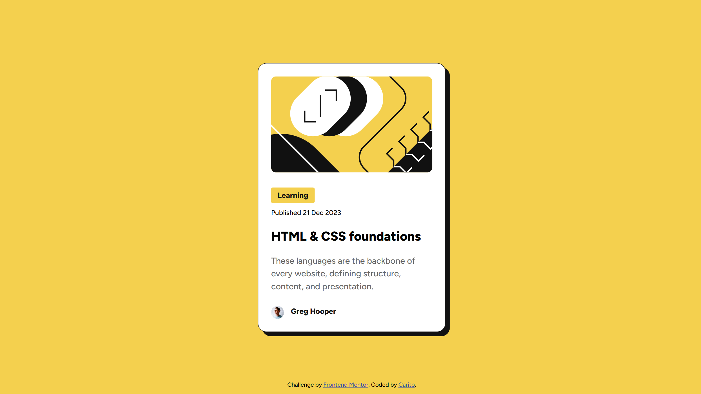
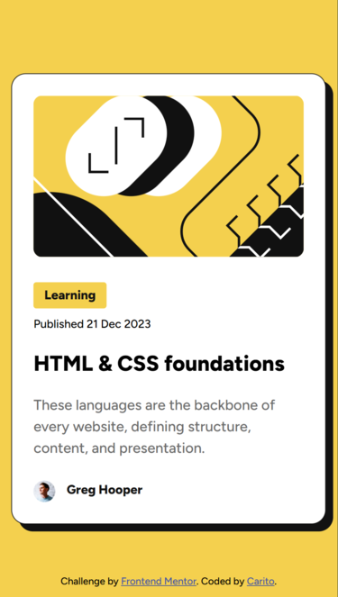

# Frontend Mentor - Blog preview card solution

This is a solution to the [Blog preview card challenge on Frontend Mentor](https://www.frontendmentor.io/challenges/blog-preview-card-ckPaj01IcS). Frontend Mentor challenges help you improve your coding skills by building realistic projects. 

## Table of contents

- [Overview](#overview)
  - [The challenge](#the-challenge)
  - [Screenshot](#screenshot)
  - [Links](#links)
- [My process](#my-process)
  - [Built with](#built-with)
  - [What I learned](#what-i-learned)
  - [Continued development](#continued-development)
  - [Useful resources](#useful-resources)
- [Author](#author)
- [Acknowledgments](#acknowledgments)

## Overview

### The challenge

Users should be able to:

- See hover and focus states for all interactive elements on the page

### Screenshot

### Links

- Solution URL: [Add solution URL here](https://your-solution-url.com)
- Live Site URL: [Add live site URL here](https://your-live-site-url.com)

## My process

### Built with

- Semantic HTML5 markup
- CSS custom properties
- Flexbox
- CSS Grid
- Mobile-first workflow

### What I learned

In this project, I practiced:

- Using semantic HTML structure
- Applying custom spacing scale with CSS variables (e.g., `--space-50`, `--space-300`)
- Styling hover and focus states on headings
- Creating consistent typography using presets (e.g., `text-preset3-bold`)
- Applying clean box-shadow and border radius for card design

### Continued development

In the future, I’d like to:

- Add responsiveness for different screen sizes
- Practice accessibility (e.g., keyboard navigation, ARIA roles)
- Convert this to a reusable component in React or Vue

### Useful resources

- [Google Fonts - Figtree](https://fonts.google.com/specimen/Figtree)
- [Frontend Mentor Community](https://www.frontendmentor.io/community)
- [MDN: CSS Custom Properties](https://developer.mozilla.org/en-US/docs/Web/CSS/--*)

## Author

- Frontend Mentor - [@carodg09](https://www.frontendmentor.io/profile/carodg09)

## Acknowledgments

Challenge by [Frontend Mentor](https://www.frontendmentor.io).  
Coded by **Carito** 💛
